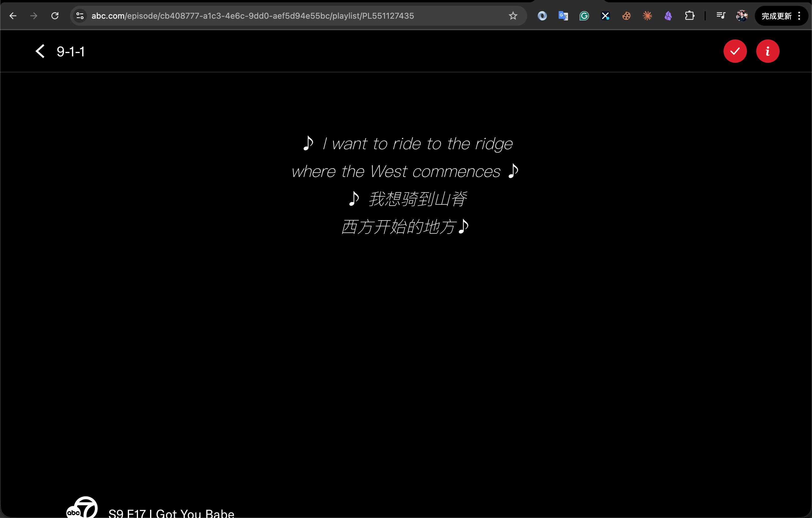

# auto-translate

一个用于翻译受支持页面内容的 Chrome 插件，当前支持 X（Twitter）时间线与 `abc.com` 视频字幕，主打免费使用（无需翻译密钥）、自动识别、多语言支持。

> 本项目为 AI Coding 实践项目，基于 OpenAI Codex（GPT-5.3-Codex）完成开发与迭代。

## 图片预览

## 当前功能

- 自动识别页面中的推文正文（`data-testid="tweetText"`）
- 自动识别并翻译推文内文章卡片标题（非中文）
- 支持 `abc.com` 视频字幕中英双语化（英文原文后追加中文翻译）
- 免费可用，无需配置任何翻译 API Key
- 多语言翻译支持（中/英/日/韩/西等）
- 支持自动翻译可见推文
- 支持手动点击 `Translate` 翻译单条推文
- 翻译结果本地缓存（7 天过期），减少重复请求
- 翻译请求节流（最小 800ms 间隔），降低接口抖动
- 限流保护（429 自动退避重试 + 短时冷却）
- 多翻译源自动切换（主服务限额/限流后自动降级到后备服务）
- 翻译按钮显示当前 Provider（如 `MyMemory / Google GTX / LibreTranslate`）
- 自动隐藏带有 `Ad` 标识的广告推文
- 右键支持：选中文字或图片可一键发送到 Grok（无需密钥、无需中转）
- Popup 中可配置：
  - 插件开关
  - 自动翻译开关
  - 目标语言

## 技术方案

- `content script` 注入到 `x.com` 与 `abc.com` 页面，分别负责推文翻译与视频字幕改写
- `service worker` 统一发起翻译请求（当前接 MyMemory 免费接口）
- 翻译服务采用多 Provider 自动降级（MyMemory -> Google GTX -> LibreTranslate）
- 后台会自动做基础语言识别（zh/ja/ko/ru/en）后再调用接口，避免 `AUTO` 参数报错
- 后台包含请求去重、请求节流、翻译缓存逻辑
- `chrome.storage.sync` 保存用户设置
- `chrome.storage.local` 保存翻译缓存

## 本地运行

1. 打开 Chrome，进入 `chrome://extensions`
2. 打开右上角 `开发者模式`
3. 点击 `加载已解压的扩展程序`
4. 选择本项目目录
5. 打开 `https://x.com` 或 `https://abc.com` 验证效果

## Changelog

> 规则：每次 `manifest.json` 版本号变更时，必须同步更新本节。

### v0.1.47
- 项目与扩展名称统一调整为 `auto-translate`
- 扩展标题、Popup、文档、隐私政策与商店文案同步去除旧品牌名
- 项目描述改为通用翻译工具表述，明确当前支持 `x.com` 时间线与 `abc.com` 视频字幕

### v0.1.46
- `abc.com` 字幕链路改为页面级 `fetch/XHR` 响应改写，不再依赖播放器上方自绘字幕层
- 新增 `translate-subtitle-vtt-text` 后台接口：直接接收原始 `WebVTT` 文本并回写双语 `WebVTT`
- `abc-page-hook` 现在会拦截 `.vtt` 请求，并把播放器实际收到的字幕文本替换为“英文原文 + 中文字幕”

### v0.1.45
- `abc.com` 字幕目标语言固定为简体中文，不再跟随 X/Twitter 的全局目标语言设置
- 修复全局目标语言被设为英文时，`abc.com` 只能显示英文、不会追加中文字幕的问题

### v0.1.44
- 修复 `abc.com` 字幕长期停留在 `Loading bilingual subtitles...` 的问题
- 改为“字幕索引 + 分段懒加载”：先解析字幕分段清单，只翻当前播放段和下一段，不再整集阻塞
- 提升单段翻译吞吐：字幕批次长度增大，减少 `Google GTX` 请求次数
- 保留旧的主清单 hook 与资源扫描兜底，但前端渲染改成按播放时间逐段补齐

### v0.1.43
- 修复 `abc.com` 播放链路竞态：直接监听页面播放接口响应获取签名主 `m3u8`，不再依赖资源扫描猜测
- 新增页面上下文 `fetch/XHR` hook，仅提取播放器播放响应中的主清单地址，再交给扩展后台拉取字幕
- 修复首帧时序问题：播放接口先返回、`video` 后挂载时不再把已获取的字幕主清单与字幕数据清空
- 加入失败兜底提示：字幕加载失败时显示 `Bilingual subtitles unavailable`，避免页面表面无变化

### v0.1.42
- 修复 `abc.com` 无效果问题：不再依赖原生 `<track>` 或播放器内建字幕
- 新增 `abc.com` 自绘字幕层：基于 `Fitt/Hive` 视频时间轴在播放器上方渲染中英双语字幕
- 新增主清单与字幕分段解析链路：自动从播放 `m3u8` 推导字幕清单并批量翻译各段 `VTT`

### v0.1.41
- 新增 `abc.com` 字幕轨道注入：检测 `WebVTT` 字幕后自动替换为中英双语字幕
- 后台新增批量 `VTT` 翻译链路：按字幕块分批翻译并保留时间轴与原文换行
- 新增 `abc.com` 与 `*.media.dssott.com` 权限，用于监听页面字幕轨道与拉取原始字幕文件

### v0.1.40
- 修复翻译缓存写入失败会导致整次翻译失败的问题（缓存失败仅告警，不阻断翻译返回）
- 内容扫描由全量改为增量（基于 MutationObserver 根节点队列），降低 X 时间线频繁变更时的开销
- 插件关闭时新增页面回滚：恢复被隐藏广告推文、移除翻译 UI、清理已绑定标记
- 优化语言策略：未知语言不再强制回退 `en`，并在未知源语言时跳过 MyMemory
- 增加图片链路大小保护与压缩降采样（超大图自动压缩，仍超限则跳过）
- 修复翻译容器无按钮场景下的潜在空指针问题，并增加并发翻译保护

### v0.1.39
- 右键菜单文案优化：`Send selected text to Grok` 改为 `使用Grok分析选定文字`

### v0.1.38
- 右键菜单文案优化：`Send image to Grok` 改为 `让Grok分析图片内容`

### v0.1.37
- 图片提示词从“请分析图片内容”调整为“中文介绍图片内容”

### v0.1.36
- 调整图片发 Grok 执行顺序：先注入文本提示，再附加图片，最后延迟提交
- 避免出现“先传图后写字”导致的上下文错位问题

### v0.1.35
- 图片发送 Grok 改为“优先文件上传注入”（通过文件输入控件注入图片）
- 键盘粘贴仅作为兜底路径，提升自动附图成功率

### v0.1.34
- 图片自动粘贴后新增延迟发送机制（默认等待约 3.2 秒）
- 延迟后再触发回车/提交按钮，降低图片尚未上传完成时发送失败概率

### v0.1.33
- 图片发 Grok 流程改回自动粘贴模式（自动触发 `⌘V/Ctrl+V` + paste 尝试）
- 粘贴后恢复自动发送流程

### v0.1.32
- 修复图片复制阶段 `Unserializable argument passed` 错误
- 注入参数由 `ArrayBuffer` 改为 `base64` 可序列化字符串传输

### v0.1.31
- 重构图片复制链路：由扩展后台下载图片二进制，再写入系统剪贴板
- 新增 X 图片域名权限（`pbs.twimg.com` / `*.twimg.com`），修复复制阶段失败问题

### v0.1.30
- 调整图片发 Grok 流程为稳定模式：复制图片后仅填入提示词，不自动发送
- 由用户在 Grok 输入框手动按 `Command+V` 粘贴图片再发送，避免跨站自动粘贴限制

### v0.1.29
- 右键图片发送 Grok 改为“复制图片本体到剪贴板”，不再发送图片 URL
- 打开 Grok 后自动尝试触发粘贴（`⌘V/Ctrl+V` + paste 命令）
- 新增 `clipboardWrite` 权限用于写入图片剪贴板

### v0.1.28
- 彻底重写 Grok 页面注入函数为老式兼容语法（`function/var`）
- 移除注入函数内潜在解析雷点，修复持续出现的行级语法报错

### v0.1.27
- 修复 Grok 自动提交轮询代码报错（移除 IIFE，改为直接 `setTimeout` 调用）

### v0.1.26
- 清理 `background.js` 中剩余可选链语法（`?.`），统一为显式判空写法
- 进一步降低旧环境下的脚本解析报错概率

### v0.1.25
- Grok 页面注入函数整体改为保守 ES 语法（`var/function`）
- 清理注入函数内高风险语法（如 `catch {}`、可选链等），降低兼容性报错概率

### v0.1.24
- 移除 Grok 注入脚本中的 `try/catch` 与可选链写法，改为显式兼容判断
- 进一步降低页面注入脚本的语法兼容风险

### v0.1.23
- 修复 Grok 注入脚本在输入框类型判定处的运行时报错
- 注入流程改为“安全赋值 + 事件触发 + contenteditable 回退”策略

### v0.1.22
- 修复 Grok 注入脚本中输入框类型判断报错（`instanceof` 改为 `tagName/type` 判定）

### v0.1.21
- 修复 Grok 注入脚本语法错误（移除页面注入函数中的 `await`）
- 提交按钮重试改为 `setTimeout` 非阻塞轮询，避免 service worker 报错

### v0.1.20
- 修复右键菜单消失问题（background 注入函数改为 async，避免 service worker 启动异常）
- 新增启动阶段菜单重建（`onStartup` + 初始化兜底）

### v0.1.19
- 图片右键发送模板简化：仅保留“请分析图片内容 + 图片地址”
- 强化 Grok 自动发送：回车后增加提交按钮轮询点击兜底

### v0.1.18
- Grok 右键注入内容调整为中文提示模板（“请分析图片内容”“请介绍这个”）
- 注入完成后自动触发回车发送，并增加提交按钮点击兜底

### v0.1.17
- 修复 Grok 输入框自动填充失败问题（适配 ProseMirror `contenteditable` 结构）
- 新增 Grok 注入重试机制，提升页面加载慢时的填充成功率

### v0.1.16
- 新增右键菜单：发送选中文字到 Grok
- 新增右键菜单：发送图片到 Grok
- 新增自动打开 Grok 并注入内容的流程（无密钥、无中转）

### v0.1.15
- README 项目描述重写：突出自动翻译、免费使用（无需密钥）、多语言支持
- Popup 标题增加 GitHub 跳转链接
- Popup 新增版权信息与 FEEI 官网链接
- 移除旧的翻译服务提示文案

### v0.1.14
- 修复日文误判为中文导致不翻译的问题（含假名文本不再走中文跳过）

### v0.1.13
- 修复卡片标题译文不显示问题（容器定位改为 ID 绑定）
- 统一支持“相邻插入”和“卡片外部插入”两种译文渲染路径

### v0.1.12
- 修复卡片标题译文显示位置：从卡片覆盖层改为卡片外部下方展示
- 避免译文压住图片/标题导致可读性问题

### v0.1.11
- 调整卡片文章标题翻译交互：不再显示翻译按钮，仅展示译文
- 推文正文保留按钮交互，卡片标题采用自动翻译输出

### v0.1.10
- 新增推文内文章卡片标题翻译（非中文标题自动注入翻译入口）
- 抽象通用节点绑定逻辑，统一处理推文正文与卡片标题

### v0.1.9
- 翻译按钮增加 Provider 标识（明确展示由哪家翻译服务提供）
- 缓存记录新增 provider 字段，缓存命中时也能显示来源

### v0.1.8
- 新增 Google GTX 后备翻译源，降低 `429 + 400` 组合失败概率
- 优化后备接口错误处理（LibreTranslate 的 `HTTP 400` 返回细化）

### v0.1.7
- 新增多翻译源自动切换（主服务不可用时自动切换后备服务）
- Provider 级限流冷却（单一服务 429 不会阻塞全部翻译）
- 新增 LibreTranslate 后备接口支持

### v0.1.6
- 新增 429 限流处理：自动退避重试
- 新增限流冷却窗口，避免连续请求导致反复报错
- 优化限流提示文案（包含建议重试等待时间）

### v0.1.5
- 新增翻译缓存（`chrome.storage.local`，7 天 TTL）
- 新增请求去重与节流（最小 800ms 间隔）
- 新增合规文档：`PRIVACY.md`、`STORE_LISTING.md`

### v0.1.4
- 新增插件 Logo 与多尺寸图标（16/32/48/128）
- Popup 顶部展示品牌图标
- 统一早期项目视觉品牌

### v0.1.3
- 中文推文默认跳过，不注入翻译入口
- 后台增加中文兜底（中文不发翻译请求）

### v0.1.2
- 新增广告推文隐藏（识别 `Ad/广告` 标签）

### v0.1.1
- 修复 MyMemory `AUTO` 源语言报错
- 增加源语言规范化与基础识别逻辑

### v0.1.0
- 初始化 Chrome MV3 插件
- 支持推文识别、手动/自动翻译、Popup 设置

## 注意事项

- 免费翻译接口存在配额和稳定性限制。
- 后续建议替换为可控翻译服务（如 DeepL / OpenAI / 自建服务）。
- X 页面 DOM 可能变化，选择器需要持续维护。

## 合规与上架文档

- 隐私政策草案：[PRIVACY.md](./PRIVACY.md)
- Chrome Web Store 上架文案草案：[STORE_LISTING.md](./STORE_LISTING.md)
